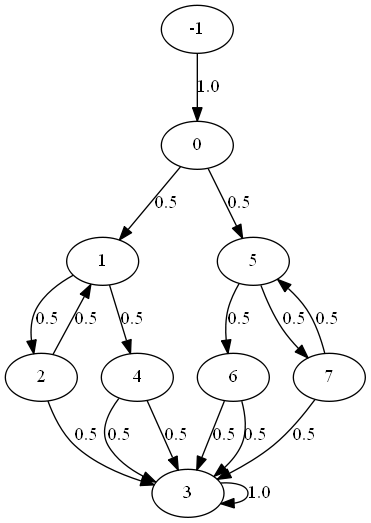

Overview
--------

jpf-probabilistic is a basic extension of Java PathFinder (JPF) to
model check randomized algorithms implemented in Java.  It allows us
to express probabilistic choices (as can be found in, for example,
randomized algorithms) in Java code so that JPF recognizes them.  As
we will discuss below, the probabilistic choices in the Java code need
to be implemented in a specific way.  Such code can be model checked
by JPF in the usual way.  As we will show below, the extension
jpf-probabilistic also allows us to print the Markov chain underlying
the randomized code.

In order to exploit jpf-probabilistic, the randomized choices in the Java
code need to be expressed by means of the method make of the class Choice,
which is part of the package probabilistic.  For example, if

    double[] p = { 0.4, 0.6 };

then the method invocation

    Choice.make(p);

returns 0 with probability 0.4 and 1 with probability 0.6.  More generally,
if p[0] + ... + p[p.length - 1] = 1.0 then the method invocation
Choice.make(p) returns i, where 0 <= i < p.length, with probability p[i].

For convenience, the classes Coin, Die and UniformChoice, which are all
part of the package probabilistic as well, can also be used to implement
randomized algorithms in Java.  For example, the class Coin has the method
flip which returns either 0 or 1, each with probability 0.5.

Let us consider a simple example.  Knuth and Yao [1] have shown how to
implement a die by means of a coin.  A variation on their algorithm can be 
coded in Java as follows.

	public int roll() {
		int state = 0;
		double[] choices = { 0.3, 0.7 };
		while (true) {
			switch (state) {
			case 0:
				switch (Choice.make(choices)) {
				case 0:
					state = 1;
					break;
				case 1:
					state = 2;
					break;
				}
				break;
			case 1:
				switch (Choice.make(choices)) {
				case 0:
					state = 3;
					break;
				case 1:
					state = 4;
					break;
				}
				break;
			case 2:
				switch (Choice.make(choices)) {
				case 0:
					state = 5;
					break;
				case 1:
					state = 6;
					break;
				}
				break;
			case 3:
				switch (Choice.make(choices)) {
				case 0:
					state = 1;
					break;
				case 1:
					return 1;
				}
				break;
			case 4:
				switch (Choice.make(choices)) {
				case 0:
					return 2;
				case 1:
					return 3;
				}
				break;
			case 5:
				switch (Choice.make(choices)) {
				case 0:
					return 4;
				case 1:
					return 5;
				}
				break;
			case 6:
				switch (Choice.make(choices)) {
				case 0:
					return 6;
				case 1:
					state = 2;
					break;
				}
				break;
			}
		}
	}

JPF, extended with jpf-probabilistic and configured appropriately, can write 
the Markov chain underlying an app, called DieTest, that invokes the above roll 
method, to a file.  For example, if we use the following configuration file

    @using jpf-probabilistic
    target = probabilistic.examples.DieTest
    listener = probabilistic.listener.StateSpaceText

then JPF writes the following output to the file probabilistic.examples.DieTest.tra.

     9 16
     -1 0 1.000000
     0 1 0.500000
     1 2 0.500000
     2 1 0.500000
     2 3 0.500000
     3 3 1.000000
     1 4 0.500000
     4 3 0.500000
     4 3 0.500000
     0 5 0.500000
     5 6 0.500000
     6 3 0.500000
     6 3 0.500000
     5 7 0.500000
     7 3 0.500000
     7 5 0.500000

The first line contains the number of states and the number of transitions.
The remaining lines describe the transitions.  Each line contains the 
source state, the target state and the probability of the transition from 
the source state to the target state.  The above textual representation of 
a Markov chain is very similar to the one found in [1].  The main 
difference is that the above one has a single final state.

JPF, extended with jpf-probabilistic and configured appropriately, can
also write the Markov chain underlying the above code, represented in
DOT format, to a file, so that it can be viewed using dotty.  For example, 
if we run JPF on the following configuration file

    @using jpf-probabilistic
    target = probabilistic.examples.DieTest
    listener = probabilistic.listener.StateSpaceDot
    probabilistic.listener.StateSpaceDot.precision = 1

then JPF produces a file named probabilistic.examples.DieTest.dot with
the following content.

    digraph statespace {
    -1 -> 0 [ label="1.0" ];
    0 -> 1 [ label="0.5" ];
    1 -> 2 [ label="0.5" ];
    2 -> 1 [ label="0.5" ];
    2 -> 3 [ label="0.5" ];
    3 -> 3 [ label="1.0" ];
    1 -> 4 [ label="0.5" ];
    4 -> 3 [ label="0.5" ];
    4 -> 3 [ label="0.5" ];
    0 -> 5 [ label="0.5" ];
    5 -> 6 [ label="0.5" ];
    6 -> 3 [ label="0.5" ];
    6 -> 3 [ label="0.5" ];
    5 -> 7 [ label="0.5" ];
    7 -> 3 [ label="0.5" ];
    7 -> 5 [ label="0.5" ];
    }

Note that probabilistic.listener.StateSpaceDot.precision captures the
number of digits of precision of the transition probabilities.  The
default value for the property probabilistic.listener.StateSpaceDot.precision
is two.  The above file represents the following diagram.

jpf-probabilistic can also be used in tandem with jpf-label.  The
latter JPF extension allows for labelling states.

1. Donald E. Knuth and Andrew C. Yao.  The Complexity of Nonuniform
   Random Number Generation.  In, J.F. Traub, editor, *Proceedings of
   a Symposium on New Directions and Recent Results in Algorithms
   and Complexity*, pages 375-428, Pittsburgh, PA, USA, April 1976.
   Academic Press.

Licensing of jpf-probabilistic
------------------------------

This extension is free software: you can redistribute it and/or modify
it under the terms of the GNU General Public License as published by
the Free Software Foundation, either version 3 of the License, or
(at your option) any later version.

This extension is distributed in the hope that it will be useful,
but WITHOUT ANY WARRANTY; without even the implied warranty of
MERCHANTABILITY or FITNESS FOR A PARTICULAR PURPOSE.  See the
GNU General Public License for more details.

You can find a copy of the GNU General Public License at
http://www.gnu.org/licenses

Installing of jpf-probabilistic
-------------------------------

To install jpf-probabilistic, follow the steps below.

1. Install JPF.
   See https://github.com/javapathfinder/jpf-core/wiki/How-to-install-JPF
   for details.

2. Install jpf-label (optional).
   
3. Install jpf-probabilistic. 

4. Build jpf-probabilistic using gradle.
   
Questions/comments/suggestions
------------------------------

Please email them to franck@cs.yorku.ca

Thanks
------

to Xin Zhang, Nastaran Shafiei, Steven Xu, Qiyi Tang, and Zainab Fatmi 
for their help with the development of jpf-probabilistic.
